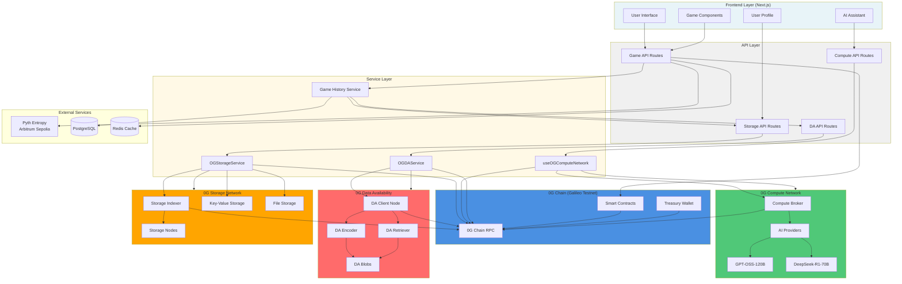
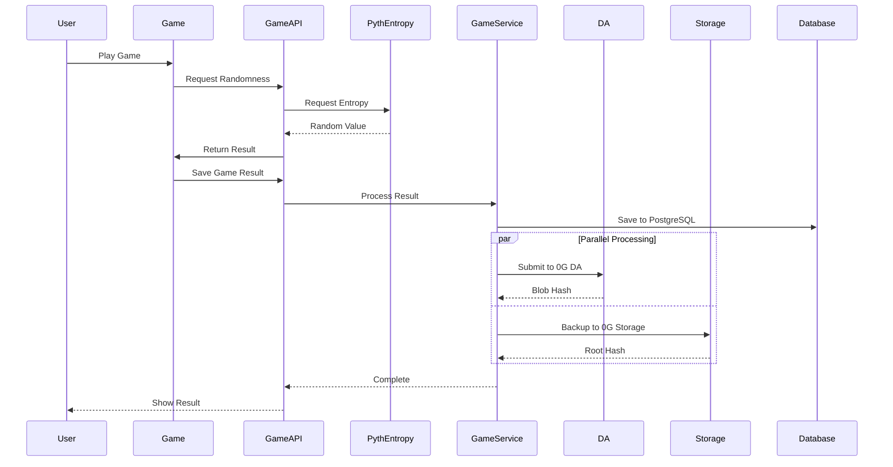
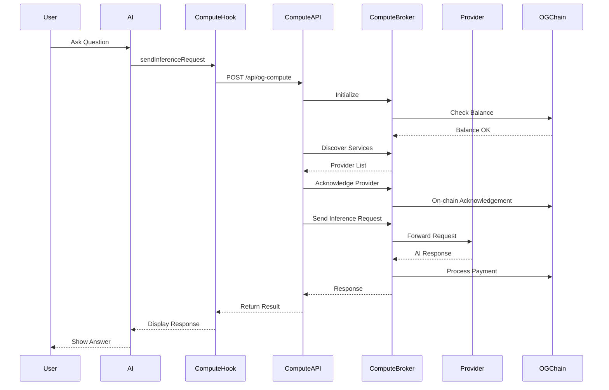
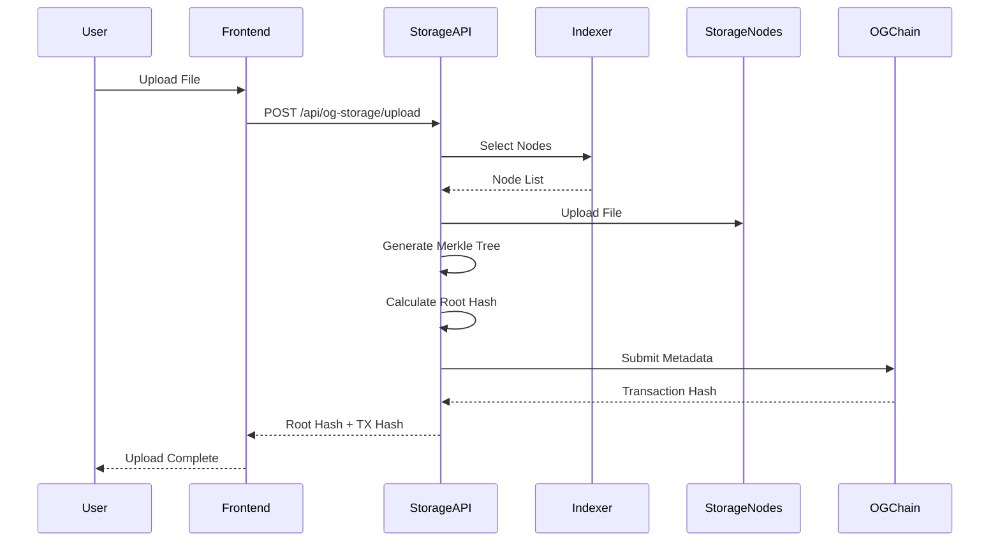
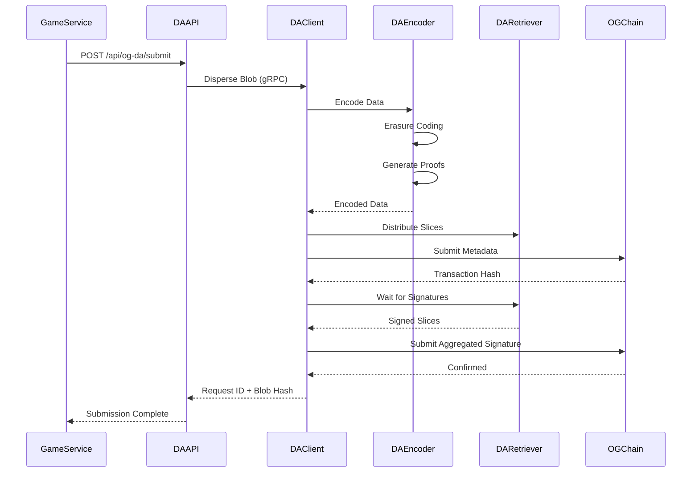
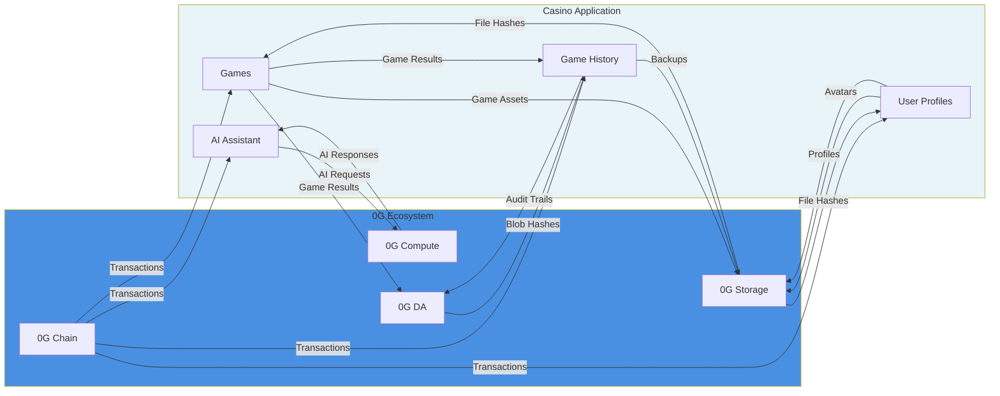
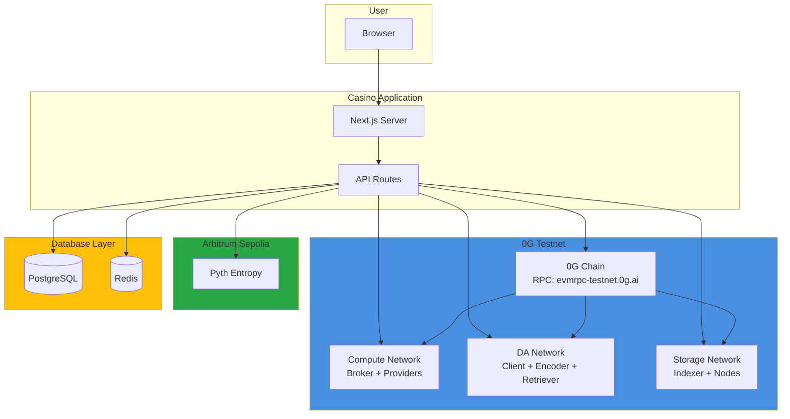
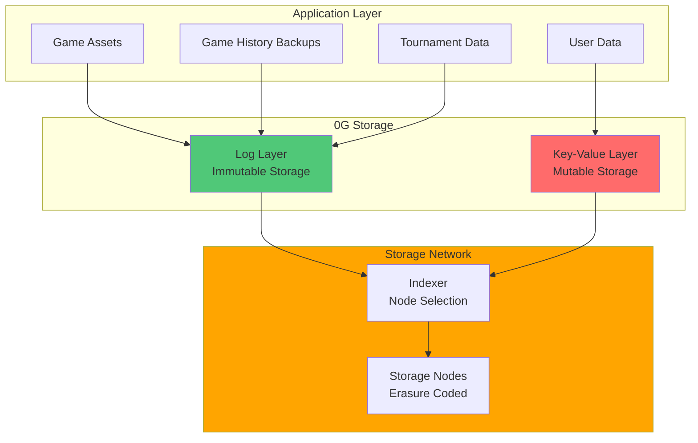
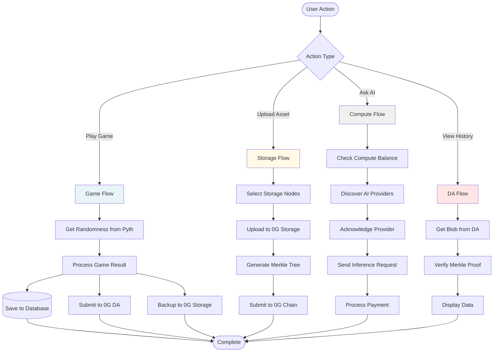

# 0G Ecosystem Integration Architecture

Complete architecture diagram showing how all 0G services are integrated into the casino application.

## System Architecture Diagram



## Data Flow Diagrams

### Game Result Flow



### AI Assistant Flow



### Storage Upload Flow



### DA Blob Submission Flow



## Component Integration Map



## Network Topology



## Storage Architecture



## Complete Integration Flow



## File Structure

```
src/
├── config/
│   ├── ogComputeNetwork.js    # Compute config
│   ├── ogDA.js                 # DA config
│   └── ogStorage.js            # Storage config
├── services/
│   ├── OGDAService.js          # DA service
│   ├── OGStorageService.js     # Storage service
│   └── OGComputeNetworkService.js # Compute service (unused - API only)
├── hooks/
│   └── useOGComputeNetwork.js  # Compute hook
└── app/
    └── api/
        ├── og-compute/          # Compute API
        ├── og-da/               # DA API
        └── og-storage/          # Storage API
```

## Key Integration Points

### 1. 0G Chain
- **Purpose**: Primary blockchain for all transactions
- **Usage**: Treasury wallet operations, contract interactions
- **RPC**: `https://evmrpc-testnet.0g.ai`

### 2. 0G Compute Network
- **Purpose**: AI inference services
- **Usage**: AI Assistant chat feature
- **SDK**: `@0glabs/0g-serving-broker`
- **Providers**: GPT-OSS-120B, DeepSeek-R1-70B

### 3. 0G Data Availability
- **Purpose**: Immutable game history and audit trails
- **Usage**: Game result logging, batch submissions
- **Protocol**: gRPC with DA Client node
- **Max Blob Size**: 32 MB

### 4. 0G Storage
- **Purpose**: Decentralized file storage
- **Usage**: Game assets, user profiles, backups
- **SDK**: `@0glabs/0g-ts-sdk`
- **Layers**: Log Layer (immutable), KV Layer (mutable)
- **Max File Size**: 10 GB

## Environment Variables

```bash
# 0G Chain
NEXT_PUBLIC_0G_RPC_URL=https://evmrpc-testnet.0g.ai
TREASURY_PRIVATE_KEY=your_private_key

# 0G Compute
NEXT_PUBLIC_0G_COMPUTE_NETWORK=testnet

# 0G DA
NEXT_PUBLIC_0G_DA_CLIENT_URL=http://localhost:51001

# 0G Storage
NEXT_PUBLIC_0G_STORAGE_INDEXER_RPC=https://indexer-storage-testnet-turbo.0g.ai
NEXT_PUBLIC_0G_FLOW_CONTRACT=0x...
NEXT_PUBLIC_0G_KV_CLIENT_ENDPOINT=http://...
```

---

**Last Updated**: November 2024  
**Version**: 1.0.0

