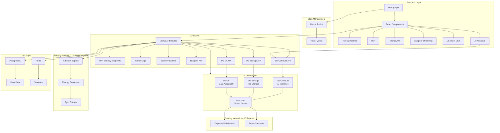
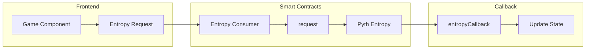
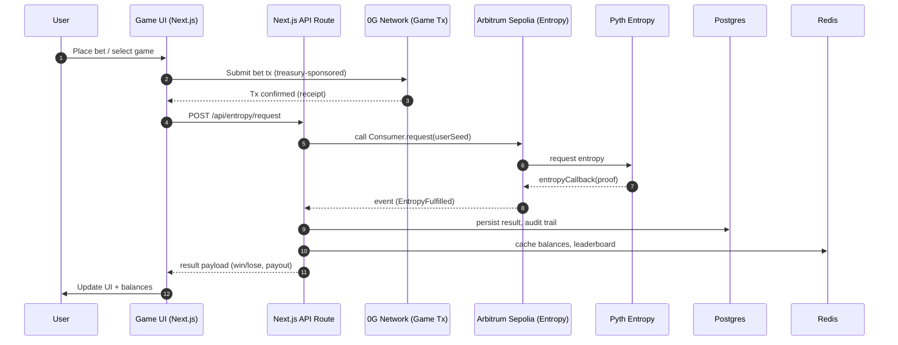

## APT-Casino 

### Demo Video: https://youtu.be/S3N7Us6uZdA
### 0g Storage, 0g Compute, 0g DA Integration Video: https://www.youtube.com/watch?v=DMvrNK7nMBo
 
A couple of days back, I was was on etherscan exploring some transactions and saw an advertisement of https://stake.com/ which was giving 200% bonus on first deposit, I deposited 120 USDT into stake.com they gave 360 USDT as total balance in their controlled custodial wallet and when I started playing casino games I was shocked to see that I was only able to play with $1 per game and was unable to increase the betting amount beyond $1 coz and when I tried to explore and play other games on the platform the issue was persisting, I reached the customer support and got to know that this platform has cheated him under the name of wager limits as I was using the bonus scheme of 200%.

When I asked the customer support to withdraw money they showed a rule list of wager limit, which said that if I wanted to withdraw the deposited amount, then I have to play $12,300 worth of gameplay and this was a big shock for me, as I was explained a maths logic by their live support. Thereby, In the hope of getting the deposited money back, I played the different games of stake.com like roulette, mines, spin wheel, etc, the entire night and lost all the money.

I was very annoyed of that's how APT-Casino was born, which is a combination of GameFi and DeFi all in one platform where new web3 users can play games, perform gambling, but have a safe, secure, transparent platform that does not scam any of their users. Also, I wanted to address common issues in traditional gambling platforms.

## 🧩 Problems

The traditional online gambling industry is plagued by several issues, including:

- **Unfair Game Outcomes:** 99% of platforms manipulate game results, leading to unfair play.  
- **High Fees:** Users face exorbitant fees for deposits, withdrawals, and gameplay.  
- **Restrictive Withdrawal Policies:** Withdrawal limits and conditions often prevent users from accessing their funds.  
- **Bonus Drawbacks:** Misleading bonus schemes trap users with unrealistic wagering requirements.  
- **Lack of True Asset Ownership:** Centralised platforms retain control over user assets, limiting their freedom and security.  
- **User Adoption of Web2 Users:** Bringing users to web3 and complexity of using wallet first time is kinda difficult for web2 users.  
- **No Social Layer:** No live streaming, no community chat, no collaborative experience.

## 💡 Solution

**APT-Casino** addresses these problems by offering:

- **Provably Fair Gaming:** Utilising the **Pyth Entropy** on-chain randomness module, my platform ensures all game outcomes are 100% transparent and verifiably fair.  


- **Flexible Withdrawal Policies:** Providing users with unrestricted access to their funds.  
- **Transparent Bonus Schemes:** Clear and clean bonus terms without hidden traps.  
- **True Asset Ownership:** Decentralised asset management ensures users have full control over their assets.  
- **Fully Gasless and Zero Requirement of Confirming Transactions:** Users do not require to pay gas fees. It's paid by our treasury address to approve a single transaction — we do it all, they can just play as if they are playing in their web2 platforms.  
- **Live Streaming Integration:** Built with **Livepeer**, enabling real-time game streams, tournaments, and live dealer interaction.  
- **On-Chain Chat:** **Supabase + Socket.IO** + wallet-signed messages ensure verifiable, real-time communication between players.  
- **ROI Share Links:** Every withdrawal (profit or loss) generates a shareable proof-link that renders a dynamic card (similar to Binance Futures PnL cards) when posted on X.

## ⚙️ Key Features

- **On-Chain Randomness:** Utilizing **Pyth Entropy** on-chain randomness module to ensure provably fair game outcomes.


- **Decentralized Asset Management:** Users retain full control over their funds through secure and transparent blockchain transactions.  
- **User-Friendly Interface:** An intuitive and secure interface for managing funds, placing bets, and interacting with games.  
- **Diverse Game Selection:** A variety of fully on-chain games, including roulette, mines, plinko, and spin wheel. As a (POC) Proof of Concept, developed fully on-chain 4 games but similar model can be applied to introduce the new casino games to the platform.  
- **Fully Gasless and Zero Requirement of Confirming Transactions:** Users do not require to pay gas fees. It's paid by our treasury address to approve a single transaction — we do it all, they can just play as if they are playing in their web2 platforms.  
- **Real-Time Updates:** Live game state and balance updates.  
- **Event System:** Comprehensive event tracking for all game actions.  
- **Social Layer:** Live streaming, on-chain chat, and NFT-based player profiles.

## 🧩 Architecture


### 0g Storage, 0g DA Architecture


### 0g Compute Architecture


- **Frontend**: Next.js (App Router), React 18, Tailwind, MUI, Three.js
- **Wallet/Chain**: wagmi + RainbowKit
- **Randomness**: Pyth Entropy (consumer contract + callback flow)
- **State**: Redux Toolkit + React Query
- **Social**: Livepeer for streaming, Supabase for real-time chat
- **Data**: PostgreSQL + Redis
- **Data Availability**: 0G DA (game history, audit trails) - [Integration Guide](./0G_DA_INTEGRATION.md)
- **Storage**: 0G Storage (game assets, user profiles, backups) - [Integration Guide](./0G_STORAGE_INTEGRATION.md)

## 🔗 Networks

- **Gaming / App Network**: 0G Network (testnet)
- **Entropy / RNG**: Arbitrum Sepolia (Pyth Entropy)
- **Data Availability**: 0G DA (for game history and audit trails)

## 🎮 Games

- **Roulette**: European layout, batch betting
- **Mines**: Pattern presets, variable risk
- **Plinko**: Physics-based ball path, auto-bet modes
- **Wheel**: Multiple segments with adjustable volatility

## 🚀 Getting Started (Dev)

Prereqs: Node >= 18

```bash
npm install
npm run dev
```

Environment variables (example):

```bash
# .env.local
NEXT_PUBLIC_NETWORK="0G_TESTNET"
NEXT_PUBLIC_RPC_URL="<YOUR_0G_RPC_URL>"
NEXT_PUBLIC_ENTROPY_CHAIN_ID="421614" # Arbitrum Sepolia
NEXT_PUBLIC_0G_DA_CLIENT_URL="http://localhost:51001" # 0G DA Client
NEXT_PUBLIC_0G_STORAGE_INDEXER_RPC="https://indexer-storage-testnet-turbo.0g.ai" # 0G Storage Indexer
NEXT_PUBLIC_LIVEPEER_API_KEY="<LIVEPEER_API_KEY>"
DATABASE_URL="<POSTGRES_URL>"
REDIS_URL="<REDIS_URL>"
TREASURY_PRIVATE_KEY="<TREASURY_PRIVATE_KEY>"
```

## 🧪 Commands

- `npm run dev` – start Next.js dev server
- `npm run build` – production build
- `npm start` – start production server
- `npm run lint` – lint
- `npm run test:og-da` – test 0G DA integration
- `npm run test:og-storage` – test 0G Storage integration

## 🏗 System Architecture (Mermaid)

**For detailed 0G integration architecture, see:** [0G Integration Architecture](./0G_INTEGRATION_ARCHITECTURE.md)

## 🏗 System Architecture (Mermaid)



## 🎲 Pyth Entropy Flow



## 🎮 Game Execution Flow


## Business Model


## 🗺 Roadmap


- Expand game catalog and volatility profiles
- In-app tournaments and prizes (Livepeer streams + leaderboards)
- ✅ 0G DA integration (game history, audit trails) - [Setup Guide](./0G_DA_SETUP_GUIDE.md)
- ✅ 0G Compute Network integration (AI assistant)
- ✅ 0G Storage integration (game assets, user profiles) - [Integration Guide](./0G_STORAGE_INTEGRATION.md)
- Performance optimization and data indexing
- SDK for third-party game devs
- ROI Share Links: Shareable proof-links for withdrawals that render dynamic cards on social platforms
- Developer Platform: Allowing third-party games and acting as a gambling launchpad/ hub for games.

## 📣 Links

- **Live (Vercel):** https://apt-casino-0g.vercel.app/ 
- **Pitch/Slides:** https://www.figma.com/deck/fJ9n6m8yrxu8ULDJXUp5sC/APT-Casino-Push--Copy-?node-id=1-1812&p=f&t=nCxzTlwH2TXsD5ku-1&scaling=min-zoom&content-scaling=fixed&page-id=0%3A1 
- **Demo Video:** https://youtu.be/S3N7Us6uZdA
- **0g Storage, 0g Compute, 0g DA Integration Video:** https://www.youtube.com/watch?v=DMvrNK7nMBo
