## APT-Casino 

A couple of days back, I was was on etherscan exploring some transactions and saw an advertisement of https://stake.com/ which was giving 200% bonus on first deposit, I deposited 120 USDT into stake.com they gave 360 USDT as total balance in their controlled custodial wallet and when I started playing casino games I was shocked to see that I was only able to play with $1 per game and was unable to increase the betting amount beyond $1 coz and when I tried to explore and play other games on the platform the issue was persisting, I reached the customer support and got to know that this platform has cheated him under the name of wager limits as I was using the bonus scheme of 200%.

When I asked the customer support to withdraw money they showed a rule list of wager limit, which said that if I wanted to withdraw the deposited amount, then I have to play $12,300 worth of gameplay and this was a big shock for me, as I was explained a maths logic by their live support. Thereby, In the hope of getting the deposited money back, I played the different games of stake.com like roulette, mines, spin wheel, etc, the entire night and lost all the money.

I was very annoyed of that's how APT-Casino was born, which is a combination of GameFi and DeFi all in one platform where new web3 users can play games, perform gambling, but have a safe, secure, transparent platform that does not scam any of their users. Also, I wanted to address common issues in traditional gambling platforms.

| Resource | Link |
|----------|------|
| Demo Video | [youtu.be/V5e2zKgOQPo](https://youtu.be/V5e2zKgOQPo) |
| 0G Storage, Compute & DA Integration Video | [youtu.be/DMvrNK7nMBo](https://youtu.be/DMvrNK7nMBo) |
| Pitch / Slides | [Figma deck](https://www.figma.com/deck/fJ9n6m8yrxu8ULDJXUp5sC/APT-Casino-Push--Copy-?node-id=1-1812&p=f&t=nCxzTlwH2TXsD5ku-1&scaling=min-zoom&content-scaling=fixed&page-id=0%3A1) |
| Live (Vercel) | [apt-casino-0g-gamma.vercel.app](https://apt-casino-0g-gamma.vercel.app/) |
| GameLogger contract (0G Mainnet) | [chainscan.0g.ai](https://chainscan.0g.ai/address/0xaca996a4d49e7ed42da68a20600f249be6d024a4?tab=transaction) |
| Treasury wallet (0G Mainnet) | [chainscan.0g.ai](https://chainscan.0g.ai/address/0xe7cd1b07900eb06d59e5b3b3c65033c484e41009?tab=transaction) |

## 🧩 Problems

The traditional online gambling industry is plagued by several issues, including:

- **Unfair Game Outcomes:** 99% of platforms manipulate game results, leading to unfair play.  
- **High Fees:** Users face exorbitant fees for deposits, withdrawals, and gameplay.  
- **Restrictive Withdrawal Policies:** Withdrawal limits and conditions often prevent users from accessing their funds.  
- **Bonus Drawbacks:** Misleading bonus schemes trap users with unrealistic wagering requirements.  
- **Lack of True Asset Ownership:** Centralised platforms retain control over user assets, limiting their freedom and security.  
- **User Adoption of Web2 Users:** Bringing users to web3 and complexity of using wallet first time is kinda difficult for web2 users.  
- **No Social Layer:** No live streaming, no community chat, no collaborative experience.

## 💡 Solution

**APT-Casino** addresses these problems by offering:

- **Provably Fair Gaming:** Utilising the **Pyth Entropy** on-chain randomness module, my platform ensures all game outcomes are 100% transparent and verifiably fair.  


- **Flexible Withdrawal Policies:** Providing users with unrestricted access to their funds.  
- **Transparent Bonus Schemes:** Clear and clean bonus terms without hidden traps.  
- **True Asset Ownership:** Decentralised asset management ensures users have full control over their assets.  
- **Fully Gasless and Zero Requirement of Confirming Transactions:** Users do not require to pay gas fees. It's paid by our treasury address to approve a single transaction — we do it all, they can just play as if they are playing in their web2 platforms.  
- **Live Streaming Integration:** Built with **Livepeer**, enabling real-time game streams, tournaments, and live dealer interaction.  
- **On-Chain Chat:** **Supabase + Socket.IO** + wallet-signed messages ensure verifiable, real-time communication between players.  
- **ROI Share Links:** Every withdrawal (profit or loss) generates a shareable proof-link that renders a dynamic card (similar to Binance Futures PnL cards) when posted on X.

## ⚙️ Key Features

- **On-Chain Randomness:** Utilizing **Pyth Entropy** on-chain randomness module to ensure provably fair game outcomes.


- **Decentralized Asset Management:** Users retain full control over their funds through secure and transparent blockchain transactions.  
- **User-Friendly Interface:** An intuitive and secure interface for managing funds, placing bets, and interacting with games.  
- **Diverse Game Selection:** A variety of fully on-chain games, including roulette, mines, plinko, and spin wheel. As a (POC) Proof of Concept, developed fully on-chain 4 games but similar model can be applied to introduce the new casino games to the platform.  
- **Fully Gasless and Zero Requirement of Confirming Transactions:** Users do not require to pay gas fees. It's paid by our treasury address to approve a single transaction — we do it all, they can just play as if they are playing in their web2 platforms.  
- **Real-Time Updates:** Live game state and balance updates.  
- **Event System:** Comprehensive event tracking for all game actions.  
- **Social Layer:** Live streaming, on-chain chat, and NFT-based player profiles.
- **Dual 0G networks:** Deposits and withdrawals use the 0G chain your wallet is connected to (Mainnet or Galileo Testnet); withdrawals are sent on the same `chainId`.

## 🧩 Architecture


### 0g Storage, 0g DA Architecture

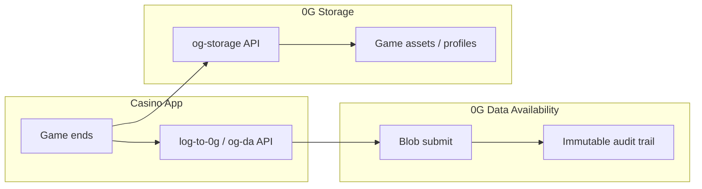
```mermaid
flowchart LR
    subgraph App["Casino App"]
        G[Game ends] --> API[log-to-0g / og-da API]
    end
    subgraph DA["0G Data Availability"]
        API --> BLOB[Blob submit]
        BLOB --> AUDIT[Immutable audit trail]
    end
    subgraph Store["0G Storage"]
        API2[og-storage API] --> FILES[Game assets / profiles]
    end
    G --> API2
```

### 0g Compute Architecture

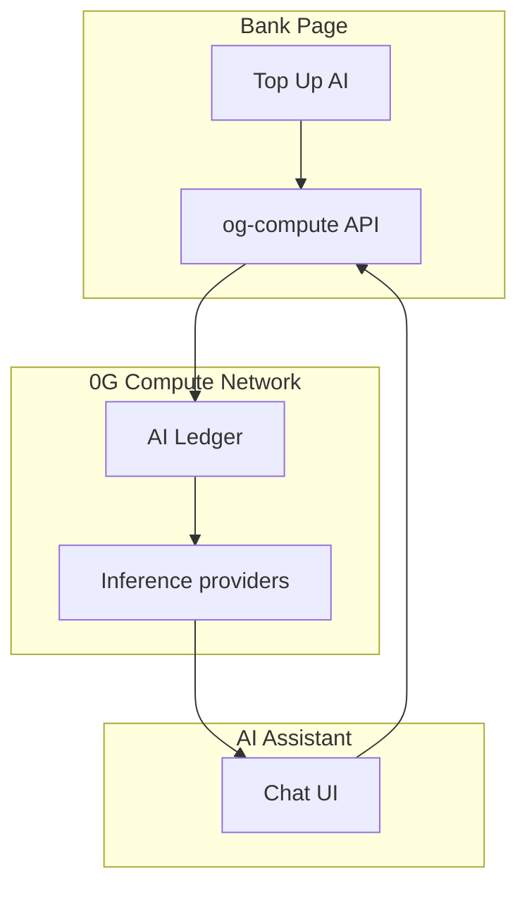
```mermaid
flowchart TB
    subgraph Bank["Bank Page"]
        TOP[Top Up AI] --> API[og-compute API]
    end
    subgraph Compute["0G Compute Network"]
        API --> LEDGER[AI Ledger]
        LEDGER --> INF[Inference providers]
    end
    subgraph Games["AI Assistant"]
        CHAT[Chat UI] --> API
        INF --> CHAT
    end
```

- **Frontend**: Next.js (App Router), React 18, Tailwind, MUI, Three.js
- **Wallet/Chain**: wagmi + RainbowKit
- **Randomness**: Pyth Entropy (consumer contract + callback flow)
- **State**: Redux Toolkit + React Query
- **Social**: Livepeer for streaming, Supabase for real-time chat
- **Data**: PostgreSQL + Redis
- **Data Availability**: 0G DA (game history, audit trails) - [Integration Guide](./0G_DA_INTEGRATION.md)
- **Storage**: 0G Storage (game assets, user profiles, backups) - [Integration Guide](./0G_STORAGE_INTEGRATION.md)

## 🔗 Networks

- **Gaming / App Network**: 0G Mainnet (chain ID `16661`) and 0G Galileo Testnet (chain ID `16602`) — switch in MetaMask; deposits and withdrawals follow your connected chain
- **Entropy / RNG**: Arbitrum Sepolia (Pyth Entropy) — treasury wallet needs Sepolia ETH for entropy fees
- **Data Availability**: 0G DA (for game history and audit trails)

## 🎮 Games

- **Roulette**: European layout, batch betting
- **Mines**: Pattern presets, variable risk
- **Plinko**: Physics-based ball path, auto-bet modes
- **Wheel**: Multiple segments with adjustable volatility

## 🚀 Getting Started (Dev)

**Production:** https://apt-casino-0g-gamma.vercel.app/

Prereqs: Node >= 18

```bash
npm install
cp .env.example .env
# Fill in .env (see .env.example for all variables)
npm run dev
```

Environment variables: copy [`.env.example`](./.env.example) to `.env` and set your values. Key entries:

```bash
# Treasury (must match TREASURY_PRIVATE_KEY)
NEXT_PUBLIC_TREASURY_ADDRESS=
TREASURY_ADDRESS=
TREASURY_PRIVATE_KEY=

# 0G Mainnet + Galileo (defaults in .env.example)
NEXT_PUBLIC_0G_MAINNET_RPC=https://evmrpc.0g.ai
NEXT_PUBLIC_0G_GALILEO_RPC=https://evmrpc-testnet.0g.ai

# Pyth Entropy (Arbitrum Sepolia)
NEXT_PUBLIC_ORACLE_CHAIN_ID=421614

NEXT_PUBLIC_WALLETCONNECT_PROJECT_ID=
NEXT_PUBLIC_SUPABASE_URL=
NEXT_PUBLIC_SUPABASE_ANON_KEY=
# DATABASE_URL=postgresql://...  # optional, for GameHistoryService
```

**Fund before going live:** OG on 0G (mainnet and/or testnet) in the treasury wallet for withdrawals; a small amount of ETH on Arbitrum Sepolia for Pyth entropy requests.

## 🧪 Commands

- `npm run dev` – start Next.js dev server
- `npm run build` – production build
- `npm start` – start production server
- `npm run lint` – lint
- `npm run clean` – clear `.next` cache if you see stale chunk errors
- `npm run test:og-da` – test 0G DA integration
- `npm run test:og-storage` – test 0G Storage integration

## 🏗 System Architecture (Mermaid)


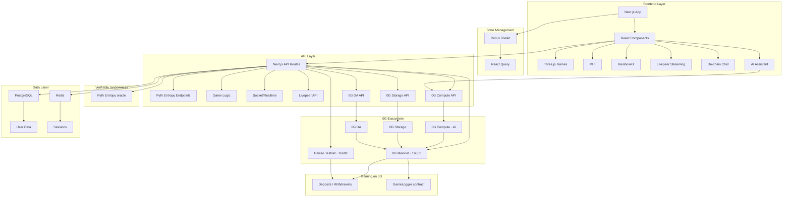
```mermaid
graph TB
    subgraph Frontend["Frontend Layer"]
        A[Next.js App] --> B[React Components]
        B --> C[Three.js Games]
        B --> D[MUI]
        B --> E[RainbowKit]
        B --> LS[Livepeer Streaming]
        B --> CC[On-chain Chat]
        B --> AI[AI Assistant]
    end
    subgraph State["State Management"]
        F[Redux Toolkit] --> G[React Query]
    end
    subgraph API["API Layer"]
        I[Next.js API Routes] --> J[Pyth Entropy Endpoints]
        I --> L[Game Logic]
        I --> SC[Socket/Realtime]
        I --> LP[Livepeer API]
        I --> OGComputeAPI[0G Compute API]
        I --> OGStorageAPI[0G Storage API]
        I --> OGDAAPI[0G DA API]
    end
    subgraph OG["0G Ecosystem"]
        OGMain[0G Mainnet · 16661]
        OGGal[Galileo Testnet · 16602]
        OGCompute[0G Compute · AI]
        OGStorage[0G Storage]
        OGDA[0G DA]
    end
    subgraph Gaming["Gaming on 0G"]
        OGMain --> DEP[Deposits / Withdrawals]
        OGGal --> DEP
        OGMain --> GL[GameLogger contract]
    end
    subgraph RNG["Verifiable randomness"]
        PE[Pyth Entropy oracle]
    end
    subgraph Data["Data Layer"]
        Q[PostgreSQL] --> R[User Data]
        S[Redis] --> T[Sessions]
    end
    A --> F
    B --> I
    AI --> OGComputeAPI
    I --> OGMain
    I --> OGGal
    I --> PE
    I --> Q
    I --> S
    OGComputeAPI --> OGCompute
    OGStorageAPI --> OGStorage
    OGDAAPI --> OGDA
    OGCompute --> OGMain
    OGStorage --> OGMain
    OGDA --> OGMain
```

## 💰 Deposit & Withdraw Flow (0G)

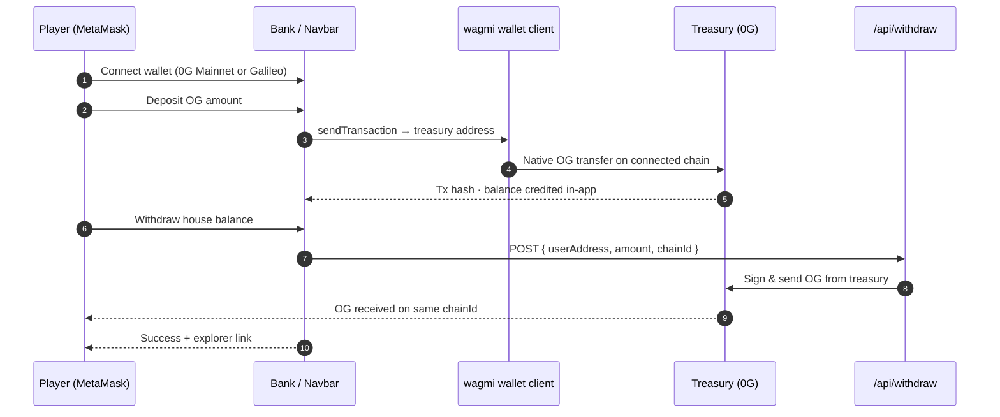
```mermaid
sequenceDiagram
    autonumber
    participant U as Player (MetaMask)
    participant UI as Bank / Navbar
    participant W as wagmi wallet client
    participant T as Treasury (0G)
    participant API as /api/withdraw

    U->>UI: Connect wallet (0G Mainnet or Galileo)
    U->>UI: Deposit OG amount
    UI->>W: sendTransaction → treasury address
    W->>T: Native OG transfer on connected chain
    T-->>UI: Tx hash · balance credited in-app

    U->>UI: Withdraw house balance
    UI->>API: POST { userAddress, amount, chainId }
    API->>T: Sign & send OG from treasury
    T-->>U: OG received on same chainId
    UI-->>U: Success + explorer link
```

## 🤖 0G Compute — AI Ledger Top-Up

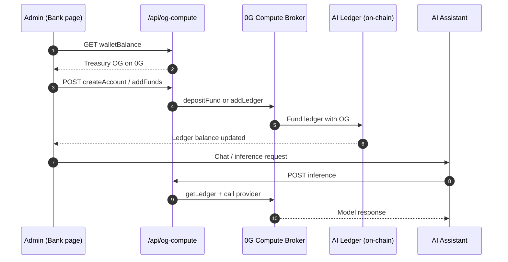
```mermaid
sequenceDiagram
    autonumber
    participant U as Admin (Bank page)
    participant API as /api/og-compute
    participant B as 0G Compute Broker
    participant L as AI Ledger (on-chain)
    participant AI as AI Assistant

    U->>API: GET walletBalance
    API-->>U: Treasury OG on 0G

    U->>API: POST createAccount / addFunds
    API->>B: depositFund or addLedger
    B->>L: Fund ledger with OG
    L-->>U: Ledger balance updated

    U->>AI: Chat / inference request
    AI->>API: POST inference
    API->>B: getLedger + call provider
    B-->>AI: Model response
```

## 📦 0G Storage & DA — Game Audit Trail

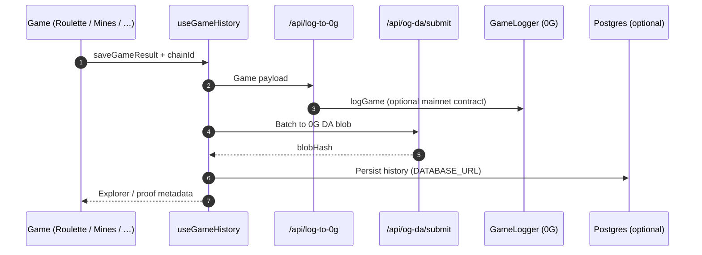
```mermaid
sequenceDiagram
    autonumber
    participant G as Game (Roulette / Mines / …)
    participant H as useGameHistory
    participant LOG as /api/log-to-0g
    participant DA as /api/og-da/submit
    participant GL as GameLogger (0G)
    participant DB as Postgres (optional)

    G->>H: saveGameResult + chainId
    H->>LOG: Game payload
    LOG->>GL: logGame (optional mainnet contract)
    H->>DA: Batch to 0G DA blob
    DA-->>H: blobHash
    H->>DB: Persist history (DATABASE_URL)
    H-->>G: Explorer / proof metadata
```

## 🎲 Pyth Entropy Flow

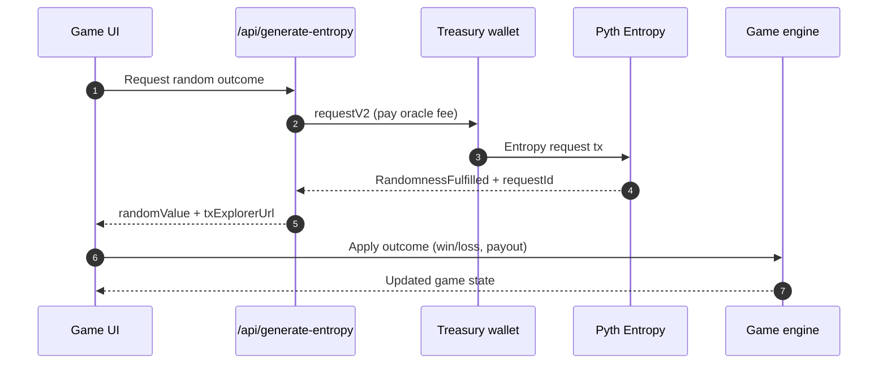
```mermaid
sequenceDiagram
    autonumber
    participant UI as Game UI
    participant API as /api/generate-entropy
    participant TW as Treasury wallet
    participant PE as Pyth Entropy
    participant G as Game engine

    UI->>API: Request random outcome
    API->>TW: requestV2 (pay oracle fee)
    TW->>PE: Entropy request tx
    PE-->>API: RandomnessFulfilled + requestId
    API-->>UI: randomValue + txExplorerUrl
    UI->>G: Apply outcome (win/loss, payout)
    G-->>UI: Updated game state
```

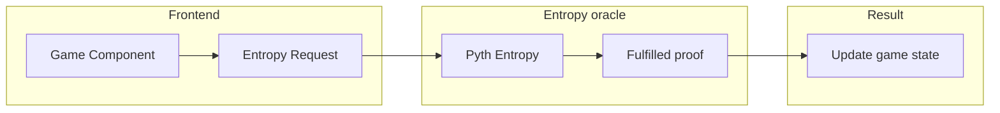
```mermaid
graph LR
    subgraph Frontend["Frontend"]
        A[Game Component] --> B[Entropy Request]
    end
    subgraph Oracle["Entropy oracle"]
        E[Pyth Entropy] --> H[Fulfilled proof]
    end
    subgraph Callback["Result"]
        H --> J[Update game state]
    end
    B --> E
```

## 🎮 Game Execution Flow

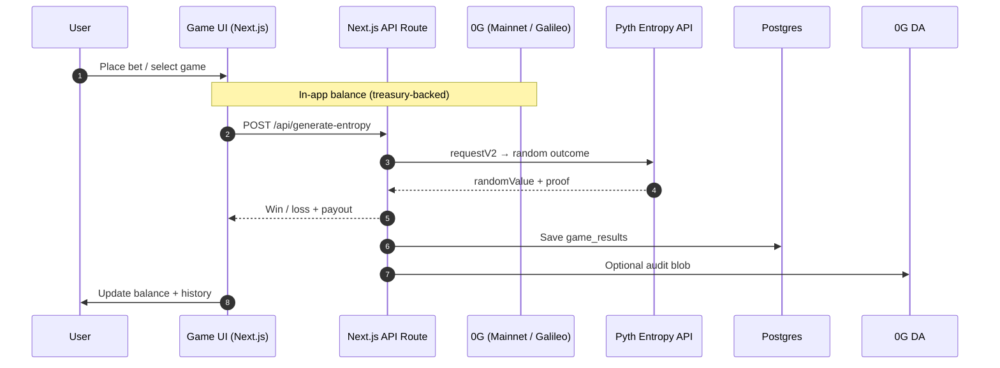
```mermaid
sequenceDiagram
    autonumber
    participant U as User
    participant UI as Game UI (Next.js)
    participant API as Next.js API Route
    participant OG as 0G (Mainnet / Galileo)
    participant RNG as Pyth Entropy API
    participant DB as Postgres
    participant DA as 0G DA

    U->>UI: Place bet / select game
    Note over UI,OG: In-app balance (treasury-backed)
    UI->>API: POST /api/generate-entropy
    API->>RNG: requestV2 → random outcome
    RNG-->>API: randomValue + proof
    API-->>UI: Win / loss + payout
    API->>DB: Save game_results
    API->>DA: Optional audit blob
    UI->>U: Update balance + history
```

## 🌐 End-to-End Player Journey

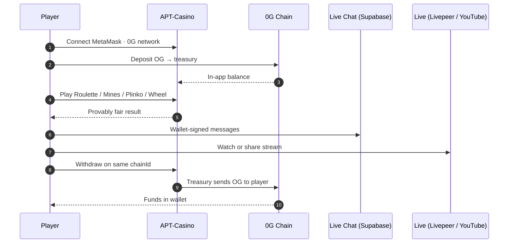
```mermaid
sequenceDiagram
    autonumber
    participant U as Player
    participant APP as APT-Casino
    participant OG as 0G Chain
    participant CHAT as Live Chat (Supabase)
    participant STREAM as Live (Livepeer / YouTube)

    U->>APP: Connect MetaMask · 0G network
    U->>OG: Deposit OG → treasury
    OG-->>APP: In-app balance
    U->>APP: Play Roulette / Mines / Plinko / Wheel
    APP-->>U: Provably fair result
    U->>CHAT: Wallet-signed messages
    U->>STREAM: Watch or share stream
    U->>APP: Withdraw on same chainId
    APP->>OG: Treasury sends OG to player
    OG-->>U: Funds in wallet
```

## 🏛 Treasury & On-Chain Logging

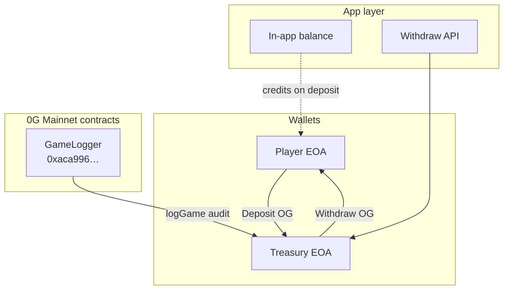
```mermaid
flowchart TB
    subgraph Wallets["Wallets"]
        P[Player EOA]
        T[Treasury EOA]
    end
    subgraph OnChain["0G Mainnet contracts"]
        GL[GameLogger<br/>0xaca996…]
    end
    subgraph OffChain["App layer"]
        REDUX[In-app balance]
        API[Withdraw API]
    end
    P -->|Deposit OG| T
    T -->|Withdraw OG| P
    API --> T
    REDUX -.->|credits on deposit| P
    GL -->|logGame audit| T
```

## Business Model


## 🗺 Roadmap


- Expand game catalog and volatility profiles
- In-app tournaments and prizes (Livepeer streams + leaderboards)
- ✅ 0G DA integration (game history, audit trails) - [Setup Guide](./0G_DA_SETUP_GUIDE.md)
- ✅ 0G Compute Network integration (AI assistant)
- ✅ 0G Storage integration (game assets, user profiles) - [Integration Guide](./0G_STORAGE_INTEGRATION.md)
- Performance optimization and data indexing
- SDK for third-party game devs
- ROI Share Links: Shareable proof-links for withdrawals that render dynamic cards on social platforms
- Developer Platform: Allowing third-party games and acting as a gambling launchpad/ hub for games.

## 📣 Links

See the [links table](#apt-casino) at the top of this README.
